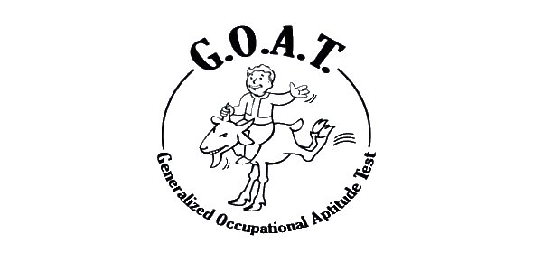

# Generalized Occupational Aptitude Test

<p align="center">
  
</p>

> The **Generalized Occupational Aptitude Test (G.O.A.T.)** is a Vault-Tec occupational assessment test that every resident of a vault is required to take at the age of 16.

Our ambition was to simulate the famous starting test in [Fallout 3](https://fallout.bethesda.net/en/games/fallout-3), so that everyone could know their role in a fallout shelter, in case of nuclear war.

The test consists of a sequence of ten questions about how you would act in certain situations. The responses to these questions determine the job you are best suited for.

## Build & Usage

Simply use the `make` command from the source tree.  
Then, call the binary as follows:

```cmd
./bin/G.O.A.T. <lang>
```

Supported languages:
- English ([Source](https://fallout.fandom.com/wiki/Generalized_Occupational_Aptitude_Test))
- French ([Source](https://fallout-wiki.com/Examen_g%C3%A9n%C3%A9ralis%C3%A9_d%27aptitude_professionnelle))
- German ([Source](https://fallout.fandom.com/de/wiki/Generalisierter_Orientierungs-_und_Assessment_Test))

## Licence

This program is released under BSD-3 clause licence. See the LICENCE file in this source distribution for more information.  
All rights from the [Fallout 3](https://fallout.bethesda.net/en/games/fallout-3) game belongs to [Bethesda](https://bethesda.net/).
